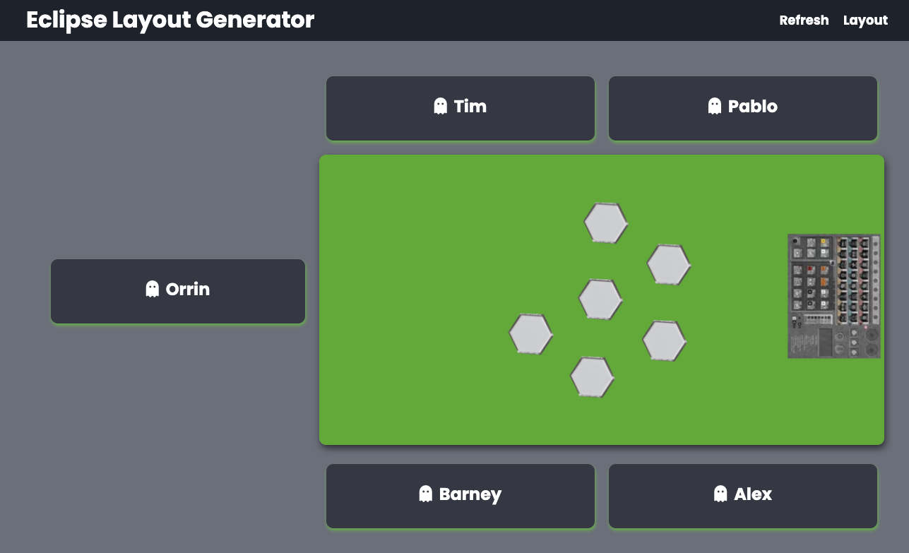

# Eclipse Setup

This is a very basic app made without any formal training in basic JS, HTML and CSS for the purposes of: 
* practicing these languages
* providing a simple app randomising the start setup of the board game Eclipse by:
  * randomising seating positions
  * randomising gaps between players

Other start parameters remain decided by a die roll, i.e. the highest die roll decides the starting player, and species are chosen by the players in reverse order of play.

## Getting Started

1. Clone the repository.
2. Enter the players' names in the `allPlayers` array on line 1 of the `script.js` file.
3. Run `npm start` in the terminal to start the server.
4. The app will open in the browser at `localhost:3030` by default.

The app will randomly assign seating positions and gaps between players.

Refreshing the page will re-randomise the seating positions and gaps.
There is a refresh button to do this automatically.

There is a link to a Layout route but this is currently an exact copy of the Home route.

## Example use

* Above the players' names are arranged around the table.
* In this five player example, the void space is indicated between Tim and Orrin.

## Planned Improvements

Whilst the app works fine and does what it is supposed to do, there are a few changes that I would like to make in the future:
1. The app uses different images for each layout and I would like to make it so that the table image remains constant and there is one layout image for each player count that is rotated to match the possible layouts.
2. Have a configuration page as the homepage where the user can enter the players' names as a prompt from the generated page.
3. Create a database to store the players' names which may be added, edited or deleted. Stored names can be selected from a selctor or checkboxes on the configuration page.
4. Add a text input field for additional users that are not to be stored in the database.
5. Ability to store the generated layout in the database for historical records.
